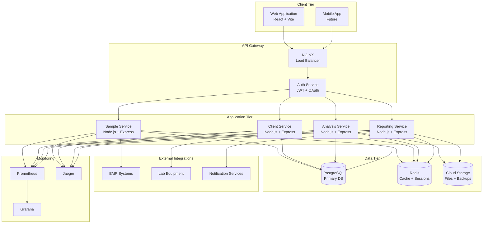

# 🧬 LabScientific LIMS - Laboratory Information Management System

[](https://github.com/your-org/labscientific-lims/actions)
[](https://sonarcloud.io/dashboard?id=labscientific-lims)
[](https://sonarcloud.io/dashboard?id=labscientific-lims)
[](https://codecov.io/gh/your-org/labscientific-lims)
[](https://opensource.org/licenses/MIT)

A comprehensive, cloud-native Laboratory Information Management System designed for modern healthcare organizations. Built with microservices architecture, advanced DevOps practices, and enterprise-grade security.

## 🚀 **DevOps Portfolio Showcase**

This project demonstrates **enterprise-level DevOps capabilities** including:

- **🐳 Containerization**: Docker, Docker Compose, Kubernetes-ready
- **☁️ Cloud-Native**: AWS/Azure/GCP deployment configurations
- **🔄 CI/CD**: GitHub Actions, automated testing, deployment pipelines
- **🧪 Testing**: Unit, integration, contract, performance, security testing
- **📊 Monitoring**: Prometheus, Grafana, Jaeger distributed tracing
- **🛡️ Security**: OWASP compliance, vulnerability scanning, secrets management
- **📚 Documentation**: Automated generation, interactive APIs, onboarding

---

## 📋 Table of Contents

- [🎯 Project Overview](#-project-overview)
- [🏗️ Architecture](#️-architecture)
- [🚀 Quick Start](#-quick-start)
- [🔧 Development Setup](#-development-setup)
- [🧪 Testing Strategy](#-testing-strategy)
- [📦 Deployment](#-deployment)
- [📊 Monitoring & Observability](#-monitoring--observability)
- [🛡️ Security](#️-security)
- [📚 Documentation](#-documentation)
- [🤝 Contributing](#-contributing)
- [📄 License](#-license)

---

## 🎯 Project Overview

LabScientific LIMS is a modern Laboratory Information Management System designed to streamline laboratory operations, manage samples, track genetic analyses, and ensure regulatory compliance in healthcare organizations.

### **Key Features**

- 🧬 **Sample Management**: Comprehensive sample tracking and lifecycle management
- 🔬 **Genetic Analysis**: Integration with laboratory equipment and analysis workflows
- 👥 **Client Management**: Patient and healthcare provider relationship management
- 📊 **Reporting**: Real-time dashboards and regulatory-compliant reports
- 🔐 **Security**: HIPAA-compliant data protection and access controls
- 📱 **Modern UI**: Responsive React-based user interface
- 🔌 **API-First**: RESTful APIs with comprehensive documentation

### **Technology Stack**

#### **Frontend**
- **React 18**: Modern component-based UI framework
- **Vite**: Fast build tool and development server
- **Tailwind CSS**: Utility-first styling framework
- **React Query**: Efficient data fetching and caching

#### **Backend**
- **Node.js**: JavaScript runtime environment
- **Express.js**: Web application framework
- **PostgreSQL**: Primary database for structured data
- **Redis**: Caching and session management

#### **DevOps & Infrastructure**
- **Docker**: Container orchestration
- **Kubernetes**: Container orchestration platform
- **GitHub Actions**: CI/CD automation
- **Terraform**: Infrastructure as Code
- **Helm**: Kubernetes package management

#### **Monitoring & Observability**
- **Prometheus**: Metrics collection and alerting
- **Grafana**: Metrics visualization and dashboards
- **Jaeger**: Distributed tracing
- **ELK Stack**: Centralized logging

---

## 🏗️ Architecture

### **System Architecture Diagram**



### **Microservices Architecture**

Our system follows a microservices architecture pattern with:

- **Service Independence**: Each service can be developed, deployed, and scaled independently
- **Database per Service**: Each service owns its data and database schema
- **Event-Driven Communication**: Asynchronous communication via message queues
- **Circuit Breaker Pattern**: Fault tolerance and resilience
- **API Gateway**: Centralized routing, authentication, and rate limiting

---

## 🚀 Quick Start

### **Prerequisites**

- **Docker Desktop** 4.0+ 
- **Node.js** 18.0+
- **Git** 2.30+
- **8GB+ RAM** (recommended for full stack)

### **1. Clone the Repository**

```bash
git clone https://github.com/your-org/labscientific-lims.git
cd labscientific-lims
```

### **2. Start the Development Environment**

```bash
# Start all services with Docker Compose
docker-compose up -d

# Wait for services to initialize (2-3 minutes)
./scripts/wait-for-services.sh

# Access the application
open http://localhost:3000
```

### **3. Verify Installation**

```bash
# Run health checks
npm run health-check

# Run smoke tests
npm run test:smoke
```

### **Default Credentials**

- **Admin User**: `admin@labscientific.com` / `AdminPassword123!`
- **Test User**: `user@labscientific.com` / `UserPassword123!`

---

## 🔧 Development Setup

### **Local Development (Recommended)**

For active development with hot reloading and debugging:

```bash
# 1. Install dependencies
npm install
cd frontend && npm install && cd ..

# 2. Setup environment variables
cp .env.example .env.local
# Edit .env.local with your configuration

# 3. Start infrastructure services only
docker-compose up -d postgres redis

# 4. Run database migrations
npm run db:migrate

# 5. Start development servers
npm run dev          # Backend API (port 3001)
npm run dev:frontend # Frontend (port 3000)
```

### **Full Docker Development**

For consistent environment across team members:

```bash
# Start all services in development mode
docker-compose -f docker-compose.dev.yml up -d

# Follow logs
docker-compose logs -f api frontend
```

### **Development Tools**

```bash
# Code quality and formatting
npm run lint         # ESLint
npm run format       # Prettier
npm run type-check   # TypeScript checking

# Database operations
npm run db:migrate   # Run migrations
npm run db:seed      # Seed test data
npm run db:reset     # Reset database

# Testing
npm run test         # Unit tests
npm run test:watch   # Watch mode
npm run test:coverage # Coverage report
```

---

## 🧪 Testing Strategy

Our comprehensive testing strategy ensures code quality and system reliability:

### **Testing Pyramid**

```
    /\     E2E Tests (Cypress)
   /  \    Integration Tests (Mocha + Chai)
  /____\   Unit Tests (Jest)
 /______\  Static Analysis (ESLint, SonarQube)
```

### **Test Commands**

```bash
# Run all tests
npm run test

# Specific test suites
npm run test:unit           # Unit tests
npm run test:integration    # Integration tests
npm run test:contract       # Contract tests
npm run test:e2e           # End-to-end tests
npm run test:performance   # Performance tests
npm run test:security      # Security tests
```

---

## 📦 Deployment

### **Environment Overview**

| Environment | Purpose | URL | Auto-Deploy |
|------------|---------|-----|-------------|
| **Development** | Local development | localhost:3000 | ❌ |
| **Testing** | Automated testing | test.labscientific.internal | ✅ |
| **Staging** | Pre-production validation | staging.labscientific.com | ✅ |
| **Production** | Live system | app.labscientific.com | 🔒 Manual |

### **Deployment Commands**

```bash
# Local deployment
docker-compose up -d

# Kubernetes deployment
helm install lims ./helm/lims

# Cloud deployment
terraform apply -var-file="prod.tfvars"
```

---

## 📊 Monitoring & Observability

### **Monitoring Stack**

- **Prometheus**: Metrics collection and alerting
- **Grafana**: Visualization and dashboards
- **Jaeger**: Distributed tracing
- **ELK Stack**: Centralized logging

### **Access Monitoring**

- **Grafana**: http://localhost:3001 (admin/admin)
- **Prometheus**: http://localhost:9090
- **Jaeger**: http://localhost:16686

---

## 🛡️ Security

### **Security Features**

- **Authentication**: JWT + OAuth 2.0
- **Authorization**: Role-based access control
- **Encryption**: TLS 1.3, AES-256
- **Compliance**: HIPAA, SOC 2 Type II
- **Scanning**: Automated vulnerability detection

### **Security Testing**

```bash
# Run security scans
npm run security:scan
npm run security:audit
docker scan labscientific/api:latest
```

---

## 📚 Documentation

### **Documentation Links**

- **API Documentation**: http://localhost:3001/api-docs
- **Architecture Docs**: [docs/architecture/](docs/architecture/)
- **Deployment Guide**: [docs/deployment/](docs/deployment/)
- **Developer Guide**: [docs/development/](docs/development/)

### **Auto-Generated Docs**

Documentation is automatically generated from:
- OpenAPI specifications
- Code comments
- Architecture decision records
- Test specifications

---

## 🤝 Contributing

### **Development Workflow**

1. Fork the repository
2. Create feature branch (`git checkout -b feature/amazing-feature`)
3. Commit changes (`git commit -m 'Add amazing feature'`)
4. Push to branch (`git push origin feature/amazing-feature`)
5. Create Pull Request

### **Code Standards**

- Follow conventional commits
- Maintain test coverage >80%
- Update documentation
- Pass all CI checks

---

## 📄 License

This project is licensed under the MIT License - see the [LICENSE](LICENSE) file for details.

---

## 🙏 Acknowledgments

- Open Source Community
- DevOps Best Practices
- Healthcare Technology Standards
- Security Community Guidelines

---

## 📞 Support

- **Documentation**: [docs.labscientific.com](https://docs.labscientific.com)
- **Issues**: [GitHub Issues](https://github.com/your-org/labscientific-lims/issues)
- **Community**: [Slack](https://yourdomain.slack.com/channels/labscientific-lims)
- **Email**: [support@labscientific.com](mailto:support@labscientific.com)

---

<div align="center">

**Built with ❤️ by the LabScientific Team**

[Website](https://labscientific.com) • [Documentation](https://docs.labscientific.com) • [Blog](https://blog.labscientific.com) • [Twitter](https://twitter.com/labscientific)

</div>