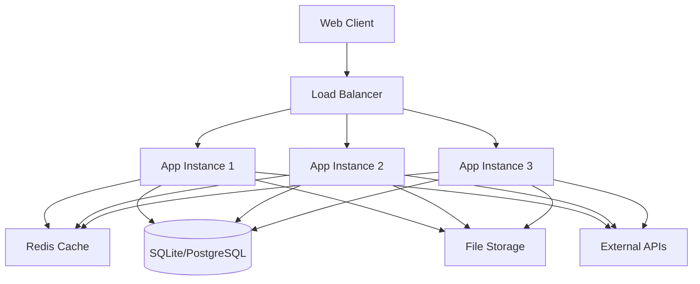

# System Architecture Overview

## High-Level Architecture



## Technology Stack

### Frontend
- **React 18** - Modern UI framework with hooks
- **Material-UI 5** - Professional component library
- **Vite** - Fast build tool and development server
- **TypeScript** - Type safety and better developer experience

### Backend
- **Node.js** - JavaScript runtime environment
- **Express.js** - Web application framework
- **Better-SQLite3** - High-performance embedded database
- **Jest** - Testing framework

### DevOps & Infrastructure
- **Docker** - Containerization
- **GitHub Actions** - CI/CD pipeline
- **Nginx** - Reverse proxy and load balancer
- **PM2** - Process management

## Key Design Decisions

### Database Strategy
- **SQLite for Development**: Fast, zero-config embedded database
- **PostgreSQL for Production**: Scalable, ACID-compliant relational database
- **Connection Pooling**: Efficient database connection management

### Security Architecture
- **Authentication**: JWT-based authentication
- **Authorization**: Role-based access control (RBAC)
- **Data Validation**: Input sanitization and validation
- **Audit Logging**: Complete activity tracking

### Performance Optimizations
- **Lazy Loading**: Component-level code splitting
- **Memoization**: React.memo and useMemo for re-render prevention
- **Database Indexing**: Optimized query performance
- **Caching Strategy**: Redis for session and data caching

## Deployment Architecture

### Development Environment
```
Developer Machine
├── Frontend (Vite Dev Server) :5173
├── Backend (Node.js) :3001
└── Database (SQLite) :file
```

### Production Environment
```
Load Balancer (Nginx)
├── App Server 1 (PM2)
├── App Server 2 (PM2)
└── App Server 3 (PM2)
    ├── Database (PostgreSQL) :5432
    ├── Cache (Redis) :6379
    └── File Storage (S3/Local)
```

## Monitoring & Observability

- **Health Checks**: Application and database health endpoints
- **Logging**: Structured logging with Winston
- **Metrics**: Performance and usage metrics
- **Error Tracking**: Comprehensive error monitoring

## Scalability Considerations

- **Horizontal Scaling**: Load balancer with multiple app instances
- **Database Scaling**: Read replicas and connection pooling
- **Caching**: Redis for session and frequently accessed data
- **File Storage**: Scalable cloud storage integration