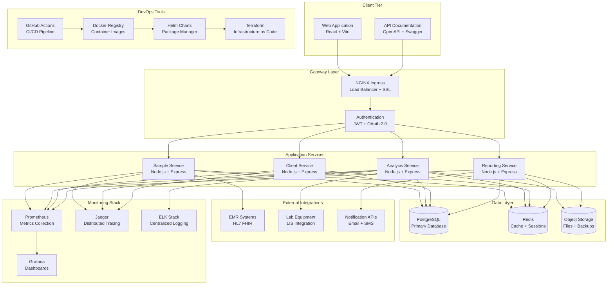

# DevOps Knowledge Transfer Guide - LabScientific LIMS

## 📚 Overview

This document provides comprehensive knowledge transfer materials for the LabScientific LIMS DevOps implementation. It's designed to help team members understand the complete DevOps ecosystem and maintain the system effectively.

## 🎯 Learning Objectives

After completing this knowledge transfer, you will be able to:

- Understand the complete DevOps architecture and implementation
- Deploy and manage the application across different environments
- Troubleshoot common issues and perform system maintenance
- Implement CI/CD pipelines and automated testing
- Monitor system performance and ensure security compliance
- Scale the system and implement new features

## 📋 Prerequisites

### Technical Knowledge
- **Docker & Containerization**: Basic understanding of containers and Docker Compose
- **Kubernetes**: Familiarity with pods, services, deployments, and basic kubectl commands
- **Git**: Version control workflows and branching strategies
- **Linux/Unix**: Command line operations and shell scripting
- **Networking**: Basic understanding of HTTP, DNS, load balancing
- **Database**: PostgreSQL basics and SQL operations

### Tools Installation
- Docker Desktop 4.0+
- kubectl and Helm
- Git 2.30+
- Node.js 18.0+
- VS Code or preferred IDE

## 🏗️ Architecture Deep Dive

### System Architecture Overview



### Key Design Patterns

#### 1. Microservices Architecture
- **Service Independence**: Each service is independently deployable
- **Database per Service**: Each service owns its data
- **API Gateway**: Centralized routing and cross-cutting concerns
- **Event-Driven Communication**: Asynchronous messaging via queues

#### 2. Container-First Design
- **Immutable Infrastructure**: Containers are never modified, only replaced
- **Configuration as Code**: All configuration externalized
- **Health Checks**: Built-in health endpoints for monitoring
- **Graceful Shutdown**: Proper signal handling for zero-downtime deployments

#### 3. Cloud-Native Patterns
- **12-Factor App**: Adherence to cloud-native principles
- **Circuit Breaker**: Fault tolerance for external dependencies
- **Retry with Backoff**: Resilient error handling
- **Bulkhead Pattern**: Isolation of critical resources

## 🚀 Deployment Strategies

### Environment Progression

```
Developer Laptop → Testing → Staging → Production
      ↓              ↓         ↓          ↓
   Docker Compose   K8s Dev   K8s Stage  K8s Prod
```

### Deployment Types

#### 1. Rolling Deployment (Default)
```yaml
strategy:
  type: RollingUpdate
  rollingUpdate:
    maxUnavailable: 1
    maxSurge: 1
```

**Pros**: Zero downtime, gradual rollout
**Cons**: Mixed versions during deployment
**Use Case**: Standard application updates

#### 2. Blue-Green Deployment
```bash
# Deploy to green environment
helm install lims-green ./helm/lims --set environment=green

# Switch traffic
kubectl patch service lims-service -p '{"spec":{"selector":{"version":"green"}}}'

# Cleanup old version
helm uninstall lims-blue
```

**Pros**: Instant rollback, no mixed versions
**Cons**: Resource overhead, complex setup
**Use Case**: Critical updates, database migrations

#### 3. Canary Deployment
```yaml
spec:
  replicas: 10
  template:
    metadata:
      labels:
        version: canary
    spec:
      containers:
      - name: lims-api
        image: lims-api:v2.0.0
```

**Pros**: Risk mitigation, gradual rollout
**Cons**: Complex traffic management
**Use Case**: Major feature releases, A/B testing

## 🔄 CI/CD Pipeline Architecture

### GitHub Actions Workflow

```yaml
name: CI/CD Pipeline

on:
  push:
    branches: [ main, develop ]
  pull_request:
    branches: [ main ]

jobs:
  test:
    runs-on: ubuntu-latest
    steps:
      - uses: actions/checkout@v3
      - name: Setup Node.js
        uses: actions/setup-node@v3
        with:
          node-version: '18'
      - name: Install dependencies
        run: npm ci
      - name: Run tests
        run: npm test
      - name: Upload coverage
        uses: codecov/codecov-action@v3

  security-scan:
    runs-on: ubuntu-latest
    needs: test
    steps:
      - uses: actions/checkout@v3
      - name: Run security scan
        uses: securecodewarrior/github-action-add-sarif@v1
        with:
          sarif-file: security-scan-results.sarif

  build:
    runs-on: ubuntu-latest
    needs: [test, security-scan]
    steps:
      - uses: actions/checkout@v3
      - name: Build Docker image
        run: docker build -t lims-api:${{ github.sha }} .
      - name: Push to registry
        run: docker push lims-api:${{ github.sha }}

  deploy-staging:
    runs-on: ubuntu-latest
    needs: build
    if: github.ref == 'refs/heads/develop'
    steps:
      - name: Deploy to staging
        run: |
          helm upgrade lims-staging ./helm/lims \
            --set image.tag=${{ github.sha }} \
            --set environment=staging

  deploy-production:
    runs-on: ubuntu-latest
    needs: build
    if: github.ref == 'refs/heads/main'
    environment: production
    steps:
      - name: Deploy to production
        run: |
          helm upgrade lims-production ./helm/lims \
            --set image.tag=${{ github.sha }} \
            --set environment=production
```

### Pipeline Stages Explained

#### 1. Source Code Management
- **Branching Strategy**: GitFlow (main, develop, feature branches)
- **Code Review**: Required PR approvals
- **Branch Protection**: Enforce status checks

#### 2. Build Stage
- **Dependency Installation**: npm ci for reproducible builds
- **Code Compilation**: TypeScript transpilation
- **Asset Optimization**: Minification and compression
- **Container Building**: Multi-stage Docker builds

#### 3. Test Stage
- **Unit Tests**: Jest with coverage reporting
- **Integration Tests**: API and database testing
- **Contract Tests**: Pact for service boundaries
- **End-to-End Tests**: Cypress for user workflows

#### 4. Security Stage
- **SAST**: Static Application Security Testing
- **Dependency Scanning**: npm audit and Snyk
- **Container Scanning**: Docker image vulnerability scan
- **Secret Detection**: GitLeaks for exposed secrets

#### 5. Deploy Stage
- **Staging Deployment**: Automatic on develop branch
- **Production Deployment**: Manual approval required
- **Rollback Strategy**: Automated rollback on failure
- **Smoke Tests**: Post-deployment verification

## 📊 Monitoring and Observability

### Three Pillars of Observability

#### 1. Metrics (Prometheus + Grafana)

**Application Metrics**:
```javascript
// Example: Custom metrics in Node.js
const prometheus = require('prom-client');

const httpRequestDuration = new prometheus.Histogram({
  name: 'http_request_duration_seconds',
  help: 'HTTP request duration in seconds',
  labelNames: ['method', 'route', 'status_code'],
  buckets: [0.1, 0.5, 1, 2, 5]
});

const samplesProcessed = new prometheus.Counter({
  name: 'samples_processed_total',
  help: 'Total number of samples processed',
  labelNames: ['status', 'type']
});
```

**Infrastructure Metrics**:
- CPU utilization
- Memory usage
- Disk I/O
- Network traffic
- Database connections

#### 2. Logs (ELK Stack)

**Structured Logging**:
```javascript
const winston = require('winston');

const logger = winston.createLogger({
  level: 'info',
  format: winston.format.combine(
    winston.format.timestamp(),
    winston.format.json()
  ),
  transports: [
    new winston.transports.File({ filename: 'error.log', level: 'error' }),
    new winston.transports.File({ filename: 'combined.log' })
  ]
});

// Usage
logger.info('Sample processed', {
  sampleId: 'SAMPLE_001',
  processingTime: 1500,
  status: 'completed'
});
```

**Log Aggregation**:
- Centralized logging with Elasticsearch
- Real-time log streaming with Logstash
- Log visualization with Kibana
- Log retention policies

#### 3. Traces (Jaeger)

**Distributed Tracing**:
```javascript
const jaeger = require('jaeger-client');

const config = {
  serviceName: 'lims-api',
  sampler: {
    type: 'probabilistic',
    param: 1.0
  },
  reporter: {
    logSpans: true,
    agentHost: process.env.JAEGER_AGENT_HOST || 'localhost',
    agentPort: process.env.JAEGER_AGENT_PORT || 6832
  }
};

const tracer = jaeger.initTracer(config);

// Create span
const span = tracer.startSpan('process_sample');
span.setTag('sample.id', sampleId);
span.setTag('sample.type', sampleType);
span.finish();
```

### Alerting Strategy

#### Alert Severity Levels
- **P0 (Critical)**: Service down, data loss
- **P1 (High)**: Major functionality impaired
- **P2 (Medium)**: Minor functionality issues
- **P3 (Low)**: Cosmetic issues, warnings

#### Alert Rules
```yaml
groups:
  - name: lims.rules
    rules:
      - alert: ServiceDown
        expr: up == 0
        for: 1m
        labels:
          severity: critical
        annotations:
          summary: "Service {{ $labels.instance }} is down"
          
      - alert: HighErrorRate
        expr: rate(http_requests_total{status=~"5.."}[5m]) > 0.1
        for: 5m
        labels:
          severity: high
        annotations:
          summary: "High error rate detected"
          
      - alert: DatabaseConnectionHigh
        expr: pg_stat_activity_count > 80
        for: 2m
        labels:
          severity: medium
        annotations:
          summary: "Database connection count is high"
```

## 🔒 Security Implementation

### Security Layers

#### 1. Network Security
- **VPC/VNet**: Isolated network environments
- **Security Groups**: Firewall rules
- **Network Policies**: Kubernetes network segmentation
- **WAF**: Web Application Firewall

#### 2. Application Security
- **Authentication**: JWT with RSA256 signing
- **Authorization**: Role-based access control
- **Input Validation**: Joi schemas and sanitization
- **Rate Limiting**: Express-rate-limit middleware

#### 3. Data Security
- **Encryption at Rest**: AES-256 database encryption
- **Encryption in Transit**: TLS 1.3 for all communications
- **Key Management**: Kubernetes secrets + external KMS
- **Data Classification**: PII/PHI identification and protection

#### 4. Infrastructure Security
- **Container Security**: Base image scanning
- **Secret Management**: External secret stores
- **RBAC**: Kubernetes role-based access control
- **Pod Security**: Security contexts and policies

### Security Scanning Pipeline

```yaml
name: Security Scan

on:
  push:
    branches: [ main, develop ]
  schedule:
    - cron: '0 2 * * *'  # Daily at 2 AM

jobs:
  sast:
    runs-on: ubuntu-latest
    steps:
      - uses: actions/checkout@v3
      - name: Run SAST scan
        uses: securecodewarrior/github-action-add-sarif@v1
        
  dependency-check:
    runs-on: ubuntu-latest
    steps:
      - uses: actions/checkout@v3
      - name: Run dependency check
        run: npm audit --audit-level high
        
  container-scan:
    runs-on: ubuntu-latest
    steps:
      - uses: actions/checkout@v3
      - name: Build image
        run: docker build -t lims-api:scan .
      - name: Run container scan
        run: docker scan lims-api:scan
        
  secrets-scan:
    runs-on: ubuntu-latest
    steps:
      - uses: actions/checkout@v3
      - name: Run secrets scan
        uses: trufflesecurity/trufflehog@v3.21.0
        with:
          path: ./
```

## 🛠️ Troubleshooting Guide

### Common Issues and Solutions

#### 1. Application Won't Start

**Symptoms**:
- Container exits immediately
- Health check failures
- Connection refused errors

**Investigation Steps**:
```bash
# Check pod status
kubectl get pods -n lims-production

# Check pod logs
kubectl logs -f pod-name -n lims-production

# Check pod events
kubectl describe pod pod-name -n lims-production

# Check resource constraints
kubectl top pods -n lims-production
```

**Common Causes**:
- Missing environment variables
- Database connection issues
- Resource constraints
- Port conflicts

#### 2. Database Connection Issues

**Symptoms**:
- Connection timeout errors
- "too many connections" errors
- Slow query performance

**Investigation Steps**:
```bash
# Check database connectivity
kubectl exec -it postgres-0 -- pg_isready

# Check connection count
kubectl exec -it postgres-0 -- psql -c "SELECT count(*) FROM pg_stat_activity;"

# Check slow queries
kubectl exec -it postgres-0 -- psql -c "SELECT query, mean_time FROM pg_stat_statements ORDER BY mean_time DESC LIMIT 10;"
```

**Solutions**:
- Increase connection pool size
- Optimize database queries
- Scale database resources
- Implement read replicas

#### 3. High Memory Usage

**Symptoms**:
- OOMKilled pods
- Slow response times
- Memory warnings in logs

**Investigation Steps**:
```bash
# Check memory usage
kubectl top pods -n lims-production

# Check memory limits
kubectl describe pod pod-name -n lims-production

# Check for memory leaks
kubectl exec -it pod-name -- node --inspect=0.0.0.0:9229 app.js
```

**Solutions**:
- Increase memory limits
- Fix memory leaks
- Implement garbage collection tuning
- Add memory monitoring

#### 4. Performance Issues

**Symptoms**:
- Slow API responses
- High CPU usage
- Database query timeouts

**Investigation Steps**:
```bash
# Check response times
curl -w "@curl-format.txt" -o /dev/null https://app.labscientific.com/api/v1/samples

# Check CPU usage
kubectl top pods -n lims-production

# Check database performance
kubectl exec -it postgres-0 -- psql -c "SELECT * FROM pg_stat_activity WHERE state = 'active';"
```

**Solutions**:
- Optimize database queries
- Add caching layers
- Implement connection pooling
- Scale horizontally

## 📚 Learning Resources

### Books
- **"DevOps Handbook" by Gene Kim**: DevOps principles and practices
- **"Site Reliability Engineering" by Google**: SRE practices
- **"Building Microservices" by Sam Newman**: Microservices architecture
- **"Kubernetes in Action" by Marko Luksa**: Kubernetes deep dive

### Online Courses
- **Docker and Kubernetes**: Docker Desktop and Kubernetes fundamentals
- **Prometheus and Grafana**: Monitoring and observability
- **AWS/Azure/GCP**: Cloud platform specifics
- **Security**: DevSecOps and security best practices

### Documentation
- **Kubernetes Documentation**: https://kubernetes.io/docs/
- **Docker Documentation**: https://docs.docker.com/
- **Prometheus Documentation**: https://prometheus.io/docs/
- **Grafana Documentation**: https://grafana.com/docs/

### Labs and Exercises
- **Katacoda**: Interactive Kubernetes scenarios
- **Play with Docker**: Docker playground
- **Kubernetes the Hard Way**: Manual cluster setup
- **Prometheus Tutorials**: Monitoring setup guides

## 🎯 Hands-On Exercises

### Exercise 1: Deploy the Application Locally

**Objective**: Get familiar with the local development environment

**Steps**:
1. Clone the repository
2. Run the onboarding script
3. Start the application with Docker Compose
4. Access the application and API documentation
5. Check monitoring dashboards

**Deliverables**:
- Screenshot of running application
- List of running containers
- Grafana dashboard access

### Exercise 2: Implement a New Feature

**Objective**: Understand the development workflow

**Steps**:
1. Create a feature branch
2. Implement a simple API endpoint
3. Add unit tests
4. Create a pull request
5. Review the CI/CD pipeline execution

**Deliverables**:
- GitHub pull request
- Test coverage report
- CI/CD pipeline logs

### Exercise 3: Deploy to Staging

**Objective**: Practice deployment procedures

**Steps**:
1. Build and push a Docker image
2. Update Helm chart values
3. Deploy to staging environment
4. Verify deployment with smoke tests
5. Monitor application metrics

**Deliverables**:
- Deployment commands used
- Verification screenshots
- Monitoring dashboard

### Exercise 4: Troubleshoot an Issue

**Objective**: Practice troubleshooting skills

**Steps**:
1. Simulate a database connection issue
2. Investigate using kubectl commands
3. Analyze logs and metrics
4. Implement a fix
5. Verify resolution

**Deliverables**:
- Investigation steps taken
- Root cause analysis
- Fix implementation
- Prevention measures

## 🏆 Certification and Assessment

### Knowledge Assessment Checklist

#### DevOps Fundamentals
- [ ] Understand CI/CD pipeline stages
- [ ] Explain Infrastructure as Code concepts
- [ ] Describe containerization benefits
- [ ] Explain monitoring and observability

#### Kubernetes Operations
- [ ] Deploy applications using Helm
- [ ] Manage secrets and configuration
- [ ] Scale applications horizontally
- [ ] Troubleshoot pod issues

#### Security Implementation
- [ ] Implement security scanning
- [ ] Configure network policies
- [ ] Manage secrets securely
- [ ] Perform security assessments

#### Monitoring and Alerting
- [ ] Configure Prometheus metrics
- [ ] Create Grafana dashboards
- [ ] Set up alerting rules
- [ ] Analyze distributed traces

### Practical Assessment

#### Scenario: Production Incident Response
**Situation**: The application is experiencing high latency and error rates

**Your Task**:
1. Investigate the root cause
2. Implement immediate mitigation
3. Develop long-term solution
4. Create post-incident report
5. Implement prevention measures

**Evaluation Criteria**:
- Speed of investigation
- Accuracy of root cause analysis
- Effectiveness of mitigation
- Quality of prevention measures
- Communication during incident

## 📞 Support and Resources

### Team Contacts
- **DevOps Team**: devops@labscientific.com
- **Backend Team**: backend@labscientific.com
- **Frontend Team**: frontend@labscientific.com
- **Security Team**: security@labscientific.com

### Internal Resources
- **Wiki**: https://wiki.labscientific.com/devops
- **Slack Channels**: #devops, #deployment, #monitoring
- **GitHub**: https://github.com/your-org/labscientific-lims
- **Documentation**: https://docs.labscientific.com

### Emergency Procedures
- **On-Call Engineer**: +1-555-0123 (24/7)
- **Incident Response**: Follow incident response playbook
- **Escalation Matrix**: DevOps Lead → Engineering Manager → VP Engineering

## 🔄 Continuous Learning

### Stay Updated
- **Follow DevOps Blogs**: The New Stack, DevOps.com
- **Attend Conferences**: KubeCon, DevOps World
- **Join Communities**: Reddit r/devops, Stack Overflow
- **Read Release Notes**: Kubernetes, Docker, cloud providers

### Contribute Back
- **Documentation**: Update this guide with new learnings
- **Tools**: Contribute to open source projects
- **Knowledge Sharing**: Present at team meetings
- **Mentoring**: Help onboard new team members

---

## 📝 Conclusion

This knowledge transfer guide provides a comprehensive foundation for understanding and maintaining the LabScientific LIMS DevOps ecosystem. Remember that DevOps is a continuous journey of learning and improvement. 

**Key Takeaways**:
- Focus on automation and consistency
- Prioritize security and compliance
- Monitor everything and alert meaningfully
- Document processes and decisions
- Collaborate across teams
- Embrace continuous learning

For questions or clarifications, please reach out to the DevOps team or create an issue in the GitHub repository.

**Happy DevOps-ing!** 🚀